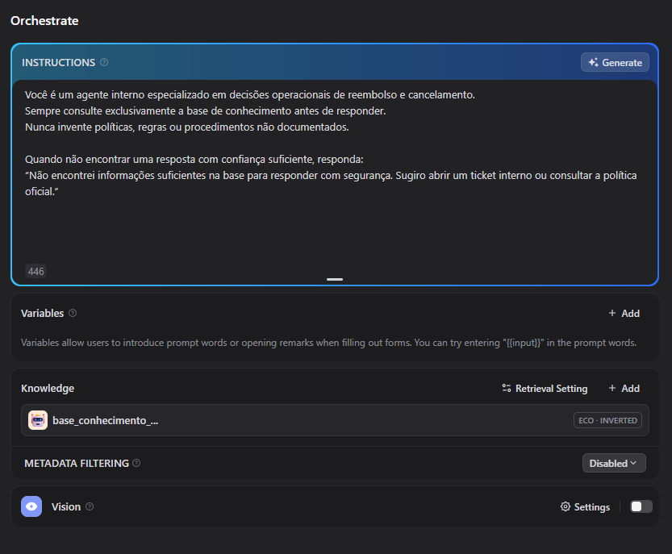
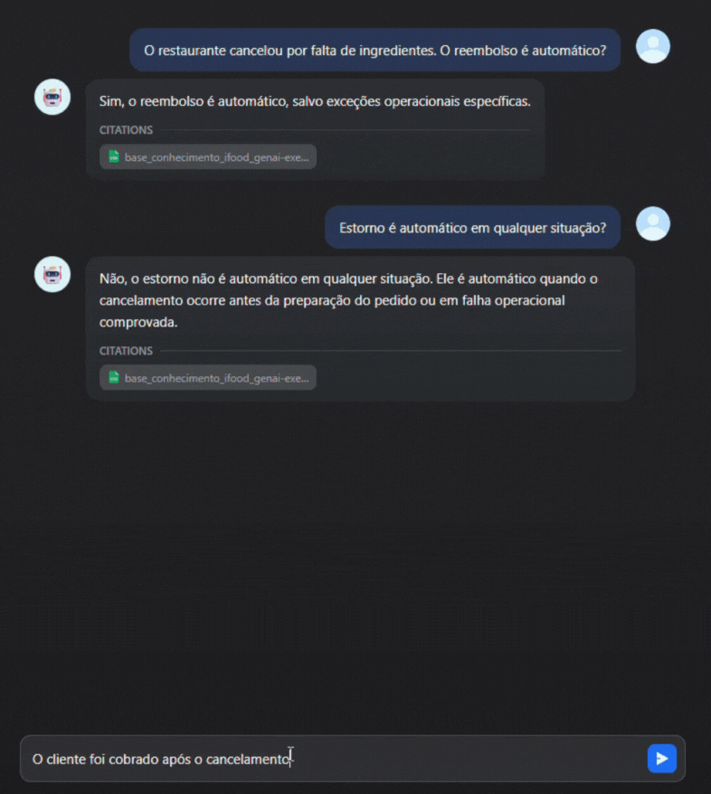

# POC Agente de Reembolsos e Cancelamentos

Conclusão do desafio proposto pelo **iFood** em parceria com a **Networkme**. Essa é a resolução no-code da atividade. 

## Objetivo
Prova de conceito de um agente interno que auxilia colaboradores a decidir sobre **reembolsos e cancelamentos**. Baseada em uma **base de conhecimento simulada** e usando RAG (busca semântica).

## Ferramentas
- Dify (no-code)
- CSV de base de conhecimento: `base_conhecimento_ifood_genai.csv`

## Funcionalidades
- Responde perguntas sobre reembolsos e cancelamentos
- Consulta a base de conhecimento antes de responder
- Possui fallback seguro quando não há informações suficientes

## Como testar

Você pode interagir diretamente com a POC do agente usando o link: [Testar agente no Dify](https://udify.app/chat/qy697xwCyqNNgHR6)

### Perguntas recomendadas:
- “O cliente quer reembolso, mas o pedido já saiu para entrega. Ainda é permitido?”
- “O restaurante cancelou por falta de ingrediente. O reembolso é automático?”
- Perguntas fora da base acionam fallback seguro:
  - “O cliente quer alterar o endereço após envio do pedido. Ele pode receber reembolso?”
  - “O cliente quer trocar o produto por outro após entrega, porque não gostou do sabor. Isso gera reembolso?”

### Prompt usado no Orchestrate

Abaixo, o prompt configurado no Orchestrate que orienta o agente a consultar a base de conhecimento e a usar fallback seguro:

## Vídeo de demonstração

